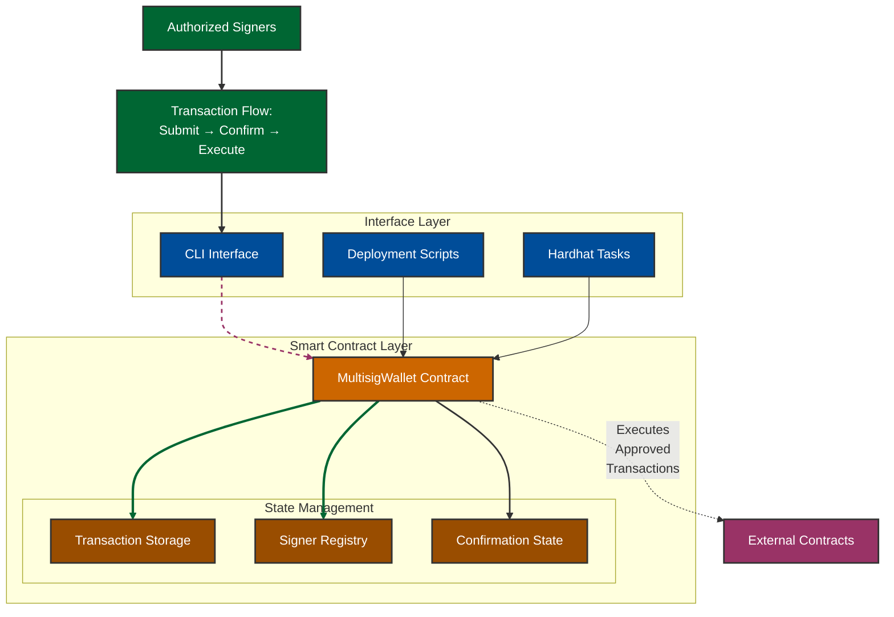

# Multisig Wallet Implementation

A secure k-of-n multisig wallet implementation with support for arbitrary contract calls and signer set updates. This implementation includes full testing capabilities and a comprehensive CLI interface for all operations.

## Architecture



## Features

- k-of-n signature scheme
- Support for arbitrary contract calls
- Signer set updates with threshold management
- Comprehensive event logging
- Gas-optimized operations
- Full test coverage
- Interactive CLI interface

## Project Structure
```
multisig-wallet/
├── contracts/
│   └── MultisigWallet.sol       # Main contract
├── scripts/
│   ├── deploy.ts                # Deployment script
│   └── fund-multisig.ts         # Funding script
├── tasks/
│   └── multisig.ts              # CLI tasks
├── test/
│   └── MultisigWallet.test.ts   # Test suite
├── .env.example                 # Environment template
├── hardhat.config.ts            # Hardhat configuration
└── package.json                 # Dependencies
```

## Setup & Installation

1. Clone the repository and install dependencies:
```bash
git clone <repository-url>
cd multisig-wallet
npm install
```

2. Configure environment:
```bash
cp .env.example .env
```

3. Compile contracts:
```bash
npx hardhat compile
```

## Testing

1. Run the test suite:
```bash
npx hardhat test
```

## Local Development & Deployment

1. Start local node:
```bash
npx hardhat node
```

2. Deploy contract:
```bash
npx hardhat run scripts/deploy.ts --network localhost
```

3. Fund the multisig:
```bash
npx hardhat run scripts/fund-multisig.ts --network localhost
```

## CLI Commands

### View Current Signers
```bash
npx hardhat get-signers --contract <ADDRESS> --network localhost
```

### Submit Transaction
```bash
npx hardhat submit-tx \
  --contract <ADDRESS> \
  --to <RECIPIENT> \
  --value <ETH_AMOUNT> \
  --data <DATA> \
  --network localhost
```

### Confirm Transaction

N/B: Use the second signer for both confirmation and execution because to meet the 2-of-3 threshold, you need another signer to confirm.

```bash
npx hardhat confirm-tx \
  --contract <ADDRESS> \
  --txindex <INDEX> \
  --network localhost
```

### Execute Transaction
```bash
npx hardhat execute-tx \
  --contract <ADDRESS> \
  --txindex <INDEX> \
  --network localhost
```

### View Transaction Details
```bash
npx hardhat get-tx-details \
  --contract <ADDRESS> \
  --txindex <INDEX> \
  --network localhost
```

### Check Balances
```bash
# Multisig balance
npx hardhat get-balance --contract <ADDRESS> --network localhost

# Recipient balance
npx hardhat get-recipient-balance --address <ADDRESS> --network localhost
```

## Example Workflow

Here's a complete example workflow that's been tested:

1. Deploy and fund the contract
2. Submit a transaction:
```bash
npx hardhat submit-tx \
  --contract <ADDRESS> \
  --to <RECIPIENT> \
  --value 0.1 \
  --data 0x \
  --network localhost
```

3. Get two confirmations:
```bash
npx hardhat confirm-tx --contract <ADDRESS> --txindex 0 --network localhost
```

4. Execute the transaction:
```bash
npx hardhat execute-tx --contract <ADDRESS> --txindex 0 --network localhost
```

5. Verify the execution:
```bash
npx hardhat get-tx-details --contract <ADDRESS> --txindex 0 --network localhost
npx hardhat get-balance --contract <ADDRESS> --network localhost
npx hardhat get-recipient-balance --address <RECIPIENT> --network localhost
```

## Security Features

- Multiple signature requirement for all operations
- Hash-based transaction verification
- Proper access control for signers
- Gas-optimized operations
- Comprehensive event logging
- Threshold enforcement
- Protection against double execution

## Test Coverage

The implementation includes comprehensive tests for:
- Contract deployment
- Transaction submission
- Transaction confirmation
- Transaction execution
- Signer set updates
- Edge cases and security scenarios

## Gas Optimization

The contract includes several gas optimization features:
- Efficient storage layout
- Minimal state changes
- Optimized data structures
- Event logging for off-chain tracking

## Demo Output

Here are actual test results demonstrating the full functionality:

```bash
# Check initial transaction details
➜ npx hardhat get-tx-details \
  --contract 0x5FbDB2315678afecb367f032d93F642f64180aa3 \
  --txindex 0 \
  --network localhost
Transaction 0:
- To: 0x70997970C51812dc3A010C7d01b50e0d17dc79C8
- Value: 0.1 ETH
- Data: 0x
- Executed: false
- Confirmations: 2

# Fund the multisig wallet
➜ npx hardhat run scripts/fund-multisig.ts --network localhost
Funding multisig wallet...
Sending 1.0 ETH to 0x5FbDB2315678afecb367f032d93F642f64180aa3
Funding successful! Transaction hash: 0x7ef9d88b08af200a2cf4b6deab84e2e67b47621fa637763f818167f678381d8c

# Check multisig balance
➜ npx hardhat get-balance \
  --contract 0x5FbDB2315678afecb367f032d93F642f64180aa3 \
  --network localhost
Multisig wallet balance: 1.0 ETH

# Execute transaction
➜ npx hardhat execute-tx \
  --contract 0x5FbDB2315678afecb367f032d93F642f64180aa3 \
  --txindex 0 \
  --network localhost
Transaction executed: 0xed7790495eb050201c6bfdfbfc88c5ebf43f12c394418740df246d8b16d8a4d3

# Verify recipient balance
➜ npx hardhat get-recipient-balance \
  --address 0x70997970C51812dc3A010C7d01b50e0d17dc79C8 \
  --network localhost
Recipient balance: 10000.099798344088286068 ETH

# Check updated multisig balance
➜ npx hardhat get-balance \
  --contract 0x5FbDB2315678afecb367f032d93F642f64180aa3 \
  --network localhost
Multisig wallet balance: 0.9 ETH

# Verify transaction execution
➜ npx hardhat get-tx-details \
  --contract 0x5FbDB2315678afecb367f032d93F642f64180aa3 \
  --txindex 0 \
  --network localhost
Transaction 0:
- To: 0x70997970C51812dc3A010C7d01b50e0d17dc79C8
- Value: 0.1 ETH
- Data: 0x
- Executed: true
- Confirmations: 2

# View current signers
➜ npx hardhat get-signers \
  --contract 0x5FbDB2315678afecb367f032d93F642f64180aa3 \
  --network localhost
Current signers: Result(3) [
  '0x70997970C51812dc3A010C7d01b50e0d17dc79C8',
  '0x3C44CdDdB6a900fa2b585dd299e03d12FA4293BC',
  '0x90F79bf6EB2c4f870365E785982E1f101E93b906'
]
```

This output demonstrates:
1. Transaction submission and confirmation
2. Wallet funding
3. Transaction execution
4. Balance updates
5. Proper signer management
6. Complete transaction lifecycle

## License

MIT
